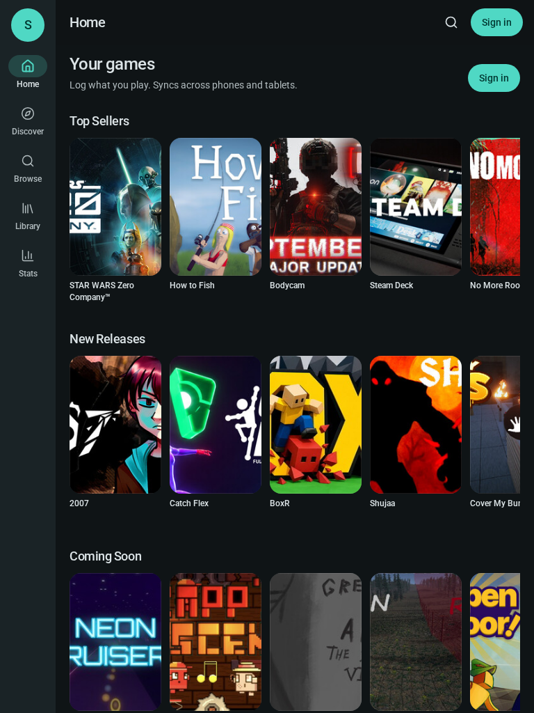
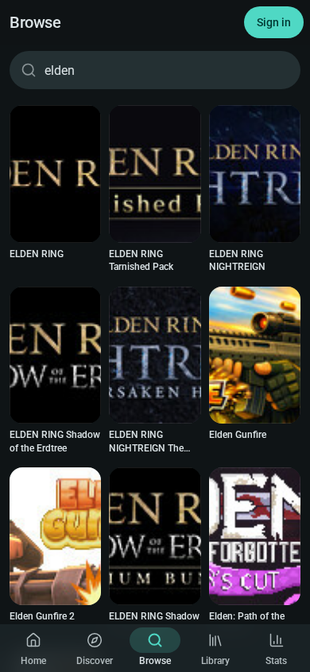
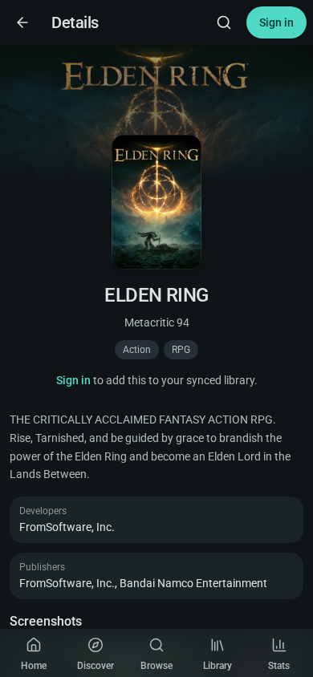
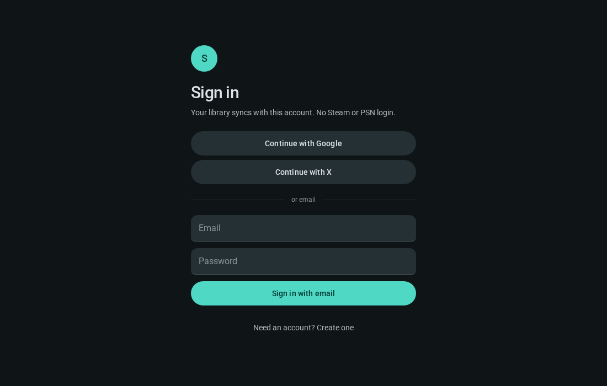
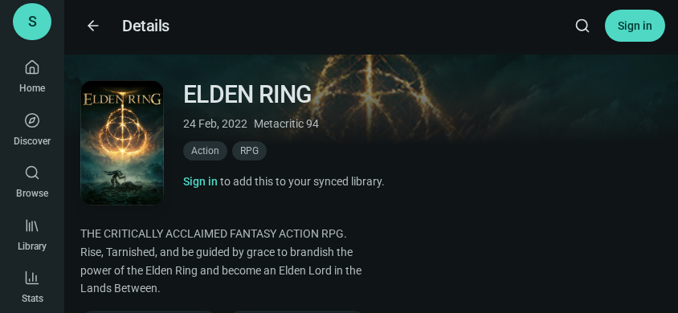
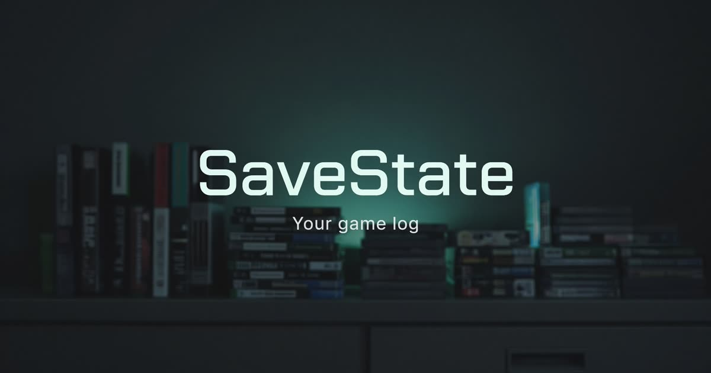

<div align="center">
  
  <h1>SaveState</h1>
  <p><strong>Your games. One log. Phone and browser, in sync.</strong></p>
  <p>A personal game library that looks like a storefront you own — not a spreadsheet wearing a dark theme.</p>

  <p>
    <a href="https://save-state-jade.vercel.app"></a>
    &nbsp;
    <a href="https://github.com/Yash8077/SaveState/releases/latest"></a>
  </p>
</div>

<p align="center">
  
</p>

---

## Why it exists

Most backlog trackers treat games like rows. SaveState treats them like **covers**.

You log what you are playing, what you beat, and what you still mean to start. The homepage feels like a store: Steam-ranked rails, PlayStation 5, real library art, and a library that remembers hours, scores, start dates, and whether you actually finished the thing.

Same account on the **website** and the **Flutter Android app**.

<p align="center">
  
  
</p>

---

## What you can do

| | |
| :--- | :--- |
| **Keep a living library** | Playing, beaten, backlog, on hold, dropped, wishlist. Hours, score, dates, favorites, notes. |
| **Discover like a store** | Trending, new releases, coming soon, and on sale — ranked by Steam popularity, not random catalogs. |
| **PlayStation, for real** | A dedicated PS5 rail. Exclusives and popular console titles, not just PC ports. |
| **See the full picture** | DLC, prequels, and sequels sit above the synopsis. Similar games sit after screenshots. |
| **Look at the art** | High-res Steam library capsules on cards. Screenshot lightbox with rounded corners and next / previous. |
| **Make it yours** | Rearrange or hide homepage sections. Dark, OLED, light, and dynamic accent. |

<p align="center">
  
  
</p>

---

## How the catalog works

SaveState is not a store and not a pirate index. It is a **log** on top of public game data.

```
Steam  ──►  popularity, sales, portraits
IGDB   ──►  metadata, DLC / sequels / similar, PlayStation
Wiki   ──►  last-resort discovery, then promoted back to IGDB
```

Search is prefix-friendly (type `astro` and find *Astro Bot*). Covers prefer Steam’s portrait library art so cards fill the 2:3 frame instead of letterboxing a landscape header.

---

## Platforms

| Surface | What you get |
| --- | --- |
| **Web** | Full library, search, details, stats, settings. Works as a PWA. |
| **Android** | Native Flutter client, same account, same rails, same tracker. |

Homepage layout (show / hide / reorder sections) is saved on each device so a PlayStation-first home on the phone does not have to match a Steam-first home on the laptop.

Every successful Android build is published to **[Releases](https://github.com/Yash8077/SaveState/releases)** with the APK and a changelog of what landed. Grab [the latest](https://github.com/Yash8077/SaveState/releases/latest) and sideload `SaveState-*.apk`.

---

## Google sign-in (free, your project)

Google OAuth is **direct** — Google → SaveState. No Grok broker, no paid auth vendor. Google Cloud OAuth is free for this (openid / email / profile).

1. [Google Cloud Console](https://console.cloud.google.com/apis/credentials) → create a project → **OAuth consent screen** (External is fine). App name: `SaveState`. Scopes: `openid`, `email`, `profile`.
2. **Create credentials → OAuth client ID → Web application**
   - Authorized JavaScript origins: `https://save-state-jade.vercel.app`
   - Authorized redirect URI: `https://save-state-jade.vercel.app/api/auth/callback/google`
3. In **Vercel → Project → Settings → Environment Variables**, add:
   - `GOOGLE_CLIENT_ID` — the client id (`….apps.googleusercontent.com`)
   - `GOOGLE_CLIENT_SECRET` — the client secret
4. Redeploy. **Continue with Google** appears on the website and in the app.

The secret stays on the server. The Android app opens a Chrome tab, Google signs you in on your domain, then returns a session into the app. Same library as email/password.

Until those two env vars are set, email sign-in still works and the Google button stays hidden.

---

## Stack

<div align="center">

[](#)
[](#)
[](#)
[](#)
[](#)
[](#)
[](#)

</div>

- **Web** — React 19, TanStack Start / Router / Query, Tailwind
- **App** — Flutter, Material 3, dynamic color
- **Auth** — email sign-in, session shared with the Android client
- **Data** — Postgres for your library; Steam, IGDB, and Wikidata for the catalog

---

## Philosophy

SaveState is the opposite of a launcher.

No storefront checkout. No “for you” slot machines. No reader, no video player, no extension zoo. Just a quiet, good-looking place to remember **what you played** — and what you still want to.

<p align="center">
  
</p>

<p align="center"><em>Log it. Beat it. Save state.</em></p>
